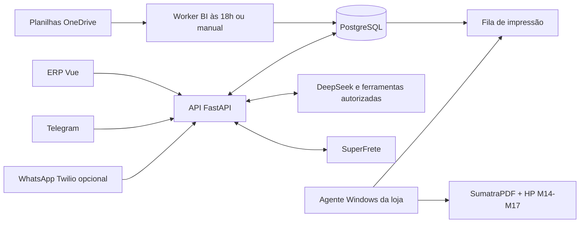

# ERP Eleven

Sistema interno da Loja Eleven: estoque, clientes, pedidos, rastreamentos, folgas,
endereços, impressão, etiquetas SuperFrete e análise das vendas lançadas no Excel.
O assistente DeepSeek opera sobre as mesmas regras e dados do ERP pelo Telegram.

Documentação revisada em **30/09/2026**. O código e as permissões do backend são a
referência do comportamento implementado; materiais em `docs/archive/` são históricos.

## O que está em uso

| Área | O que oferece | Tela |
| --- | --- | --- |
| Dashboard | Estoque e rastreios; cards lado a lado de endereços e vendas, resumos e atalhos | `/dashboard` |
| Estoque | Produtos, variantes, loja/depósito, entradas, saídas, inventário, etiquetas e OCR | `/inventory` |
| Clientes e pedidos | Cadastros, tags, anexos, etapas do pedido e vínculos logísticos | `/clientes`, `/pedidos` |
| Rastreamento | Consulta e atualização via Wonca; sincronização com pedidos | `/rastreamento` |
| Equipe e folgas | Vendedores, calendário, consulta e cadastro de folgas | `/vendors`, card de folgas |
| Endereços e envios | Agenda sem duplicatas, remetentes, modelos A4, histórico, CEP e SuperFrete | `/enderecos` |
| Visão de vendas | Resultados salvos das planilhas OneDrive, comparações, moedas e rankings | `/bi-vendas` |
| Assistente IA | Vínculos de funcionários, ações confirmadas, memória, consultas e filas | `/assistente` |
| Acesso e auditoria | Conta individual, troca de senha, vendas pessoais e atividade por usuário | `/conta`, `/usuarios`, `/auditoria` |

**As vendas da operação são lançadas no Excel.** O BI lê os resultados corrigidos
salvos nas planilhas, não altera células e não cria vendas no ERP. A sincronização
ocorre diariamente às **18h de Brasília** ou pelo botão **Atualizar dados**.
O detalhamento inclui lançamentos individuais, moedas e dias; o gráfico por hora
só aparece quando existem horários reais nas células. O fechamento mensal corrigido
continua separado da soma das linhas. Denis, Sol e Junior veem apenas suas vendas;
Lucas e Wissam veem o geral. Usuários e auditoria são exclusivos de Lucas.

Fotos de comprovantes dos Correios podem virar uma prévia de rastreios no Telegram,
com conferência e confirmação antes de cadastrar. No gestor de endereços, o gerador
4Devs permite revisar uma pessoa gerada e cadastrar somente os campos de remetente
após aprovação manual. O cadastro conserva a identificação de dados sintéticos.

Os módulos `/vendas`, `/pdv`, `/fiado` e `/exchange-rates` continuam implementados e
acessíveis. São fluxos próprios, separados do BI; não foram removidos só por não
serem o caminho principal atual. O canal WhatsApp via Twilio está implementado,
mas sua ativação depende da conta/remetente e das flags do ambiente. **Não existe
conector Meta Cloud API direto neste repositório.**

## Fluxo principal



O bot conversa em linguagem natural. Consultas leem o estado do ERP; operações
que escrevem ou imprimem passam pelas permissões e confirmações do fluxo. O
computador da loja busca trabalhos por HTTPS; o laptop de desenvolvimento não é
servidor de impressão.

## Começar pela documentação certa

- [Escopo e regras do produto](docs/ESCOPO.md): funcionalidades, limites e decisões da loja.
- [Arquitetura e mapa do código](docs/ARQUITETURA.md): onde alterar cada módulo, dados e processos.
- [Desenvolvimento e validação](docs/DESENVOLVIMENTO.md): ambiente local, banco, testes e build.
- [Deploy e operação](docs/OPERACAO.md): Render, variáveis, workers, horários e diagnóstico.
- [Índice completo dos guias](docs/README.md): bot, impressão, endereços e BI.
- [Acesso individual e auditoria](docs/ACESSO_AUDITORIA.md): sessões, permissões, senhas e uso das telas.
- [Clientes, pedidos e pacotes](docs/CLIENTES_PEDIDOS_RASTREIOS.md): vínculos explícitos e entregas parciais.
- [Comprovantes por foto](docs/RASTREIOS_COMPROVANTES.md) e [remetentes gerados](docs/REMETENTES_GERADOS.md).
- [Auditoria de manutenção](docs/AUDITORIA_MANUTENCAO.md): remoções verificadas e dívida técnica restante.

## Estrutura

```text
backend/
  app/                 API, modelos, contratos e serviços; CLIs dos provedores
  alembic/             Histórico executável de migrações — não apagar revisões
  tests/               Testes isolados, sem credenciais de produção
  .env.example         Configuração de referência, sem segredos
frontend/
  src/views/           Telas roteadas
  src/components/      Componentes dos módulos e cards do dashboard
  src/services/        Cliente HTTP e contratos TypeScript
  src/stores/          Estado compartilhado com Pinia
  src/router/          Rotas e controle de acesso da navegação
  src/locales/         Traduções pt/es/en
  package-lock.json    Versões Node reproduzíveis
  .nvmrc               Node 22 para desenvolvimento
  Dockerfile           Alternativa local; produção usa site estático Render
tools/eleven-print-agent/  Instalador e agente PowerShell para Windows
docs/                  Guias atuais e histórico separado em archive/
.github/workflows/     Build, tipagem e testes em integração contínua
render.yaml            Referência da infraestrutura Render
docker-compose.yml     Ambiente local opcional, sem conexão com a produção
```

## Executar e verificar

Requisitos: **Python 3.11**, **Node 22** e **PostgreSQL**. As instruções de banco
existente/restauração em [Desenvolvimento](docs/DESENVOLVIMENTO.md) são necessárias:
as primeiras revisões Alembic pressupõem um esquema anterior e não constituem um
bootstrap completo de banco vazio.

```sh
# Backend — em um banco local preparado
cd backend
python3.11 -m venv venv
source venv/bin/activate
pip install -r requirements.txt -r requirements-dev.txt
cp .env.example .env
# Configure DATABASE_URL e SECRET_KEY locais antes de continuar.
alembic upgrade head
uvicorn app.main:app --reload --host 127.0.0.1 --port 8000
```

```sh
# Outro terminal, a partir da raiz
cd frontend
nvm use                    # se usar nvm
npm ci --include=dev
npm run dev
```

Frontend: `http://localhost:3000`. API e contrato OpenAPI: `http://localhost:8000/docs`.
Em produção a navegação usa hash, por exemplo `/#/enderecos`.

```sh
# Da raiz; DATABASE_URL explícita protege o banco real guardado no .env.
PYTHONPATH=backend DATABASE_URL=sqlite:// backend/venv/bin/python -m pytest backend/tests -q
npm --prefix frontend test
npm --prefix frontend run type-check
npm --prefix frontend run build
```

A suíte SQLite valida regras isoladas; não comprova migrações nem locks PostgreSQL,
credenciais externas ou impressão física. O lint é uma verificação separada e ainda
aponta usos antigos de `any`; veja a auditoria antes de interpretá-lo como regressão.

## Regras para manutenção

- Nunca versionar `.env`, credenciais do agente, dados de clientes, PDFs ou planilhas da loja.
- Não usar o banco do `.env` local em testes: ele pode apontar para a produção.
- Não editar migrações aplicadas, apagar histórico operacional nem executar os SQLs arquivados como atualização.
- Não misturar `Cliente` de pedidos com `PdvCliente`, nem vendas de planilha com vendas/fiado do PDV.
- Ações externas incertas não devem ser repetidas automaticamente: conferir antes de pagar ou imprimir novamente.
- Mudanças de comportamento devem atualizar o guia do módulo e ter validação proporcional ao risco.
